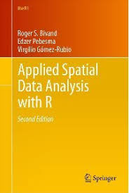
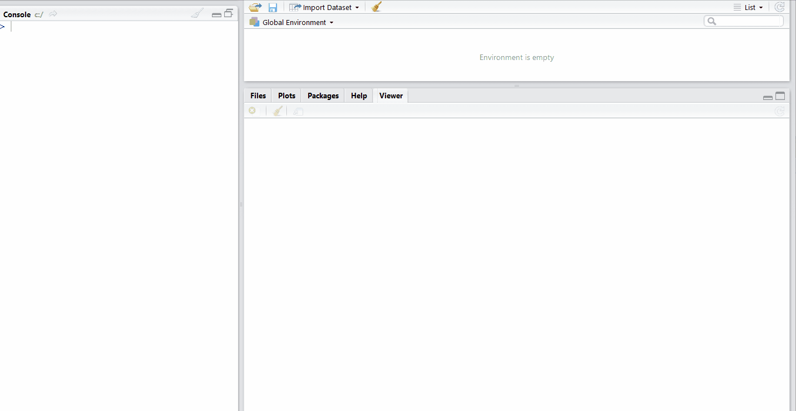

```{r, include=FALSE}
mapview::mapviewOptions(basemaps = "Esri.WorldImagery", leafletWidth = 1050,
                        leafletHeight = 320)
```

# What am I talking about today?
* Why bother?
* Vector data
* Raster data
* Recent advances in R GIS
* Other OpenGIS platforms

---
# Why OpenGIS?
* It's free
* It works
* You can make it better... **seriously!**

---
# Why R?
* It's not just a GIS
* It's only going to get better
* Reproducibility
* You have to write code... **that's a good thing!**

---

# Resources

## Books
* [R for Data Science](http://r4ds.had.co.nz/) 
* [Applied Spatial Data Analysis in R](http://www.springer.com/gp/book/9781461476177) 

## Online
* [Stack Overflow](https://stackoverflow.com/)

---
# What packages are we using today?
* [rgdal](https://cran.r-project.org/web/packages/rgdal/index.html): import/export spatial data
* [sp](https://cran.r-project.org/web/packages/sp/index.html): vector classes
* [rgeos](https://cran.r-project.org/web/packages/rgeos/index.html): vector geospatial analysis
* [raster](https://cran.r-project.org/web/packages/raster/index.html): raster classes and geospatial analysis
* A few others...
---
# Points: `sp::SpatialPointsDataFrame`

```{r, cache=TRUE}
# download gbif data
bird_pts <- rgbif::occ_search(scientificName = "Anisognathus igniventris",
  hasCoordinate = TRUE, limit = 100,
  hasGeospatialIssue = FALSE, return = "data")
bird_pts <- as.data.frame(bird_pts)[, c(1, 3:4, 35, 69)]
# convert to spatial points object
bird_pts <- sp::SpatialPointsDataFrame(
  coords = bird_pts[, c("decimalLongitude", "decimalLatitude")],
  data = bird_pts,
  proj4string = sp::CRS("+init=epsg:4326"))
```
---
# Points: `sp::SpatialPointsDataFrame`

```{r, eval=FALSE}
# make interactive map
mapview::mapview(bird_pts)

```

```{r, echo=FALSE}
# make interactive map
mapview::mapview(bird_pts)@map
```

---
# Lines: `sp::SpatialLinesDataFrame`

```{r, eval=FALSE}
# load data
data("Gulk", package = "riverdist")
# make interactive map
mapview::mapview(Gulk$sp, color = "red")
```

```{r, echo=FALSE}
# load data
data("Gulk", package = "riverdist")
# make interactive map
mapview::mapview(Gulk$sp, color = "red", leafletHeight = 290)@map
```

---
# Polygons: `sp::SpatialPolygonsDataFrame`

```{r, include=FALSE, cache=TRUE}
pas <- raster::shapefile("data/WDPA_July2017_COL-shapefile-polygons.shp")
pas@data$WDPAID <- NULL
pas2 <- pas[pas$IUCN_CAT %in% c("Ia", "II", "III", "IV", "V"), ]
pas3 <- rgeos::gSimplify(pas2, tol = 1e-3, topologyPreserve=TRUE)
pas4 <- sp::SpatialPolygonsDataFrame(pas3,
  pas@data[1 + as.numeric(sapply(pas3@polygons, slot, name = "ID")), ])
raster::shapefile(pas4, "data/pas.shp", overwrite = TRUE)
```

```{r, eval=FALSE}
# load data
pas <- raster::shapefile("data/pas.shp")
# visualize data
mapview::mapview(pas, zcol = "IUCN_CAT", legend = TRUE)
```

```{r, echo=FALSE}
# load data
pas <- raster::shapefile("data/pas.shp")
# visualize data
mapview::mapview(pas, zcol = "IUCN_CAT", legend = TRUE)@map
```

---
# Import/export vector data

```{r, eval = FALSE}
# load a shapefile
shp <- raster::shapefile("my_data.shp")
# load a shapefile from a subfolder
shp_2 <- raster::shapefile("folder/my_data.shp")
# export a shapefile
raster::shapefile(shp_2, "my_data_2.shp")
# load a kml file
kml <- rgdal::readOGR(".", "my_data.kml")
# load a kml file from a subfolder
kml_2 <- rgdal::readOGR("folder", "my_data.kml")
# export kml
rgdal::writeOGR(".", "my_data_2.kml", overwrite = TRUE, driver = "KML")
```

.footnote[see `rgdal::ogrDrivers()` for list of available read/write formats]

---
# What does it mean?
```{r}
bird_pts
```

---
# Accessing vector data
```{r}
# object structure
str(bird_pts, max = 3)
```

---
class: left, top
# Accessing vector data

.pull-left[
```{r, fig.keep="none"}
# extract data from attribute table
bird_data <- bird_pts@data
# extract year observations were made
year_recorded <- bird_pts@data$year
# a shorter way of writing this
year_recorded <- bird_pts$year
# plot histogram
hist(year_recorded)
# add in new column to attribute table
bird_pts$log_elevation <-
  log10(bird_pts$elevation)
```
]

.pull-right[
```{r, echo=FALSE, fig.height=4.0}
hist(year_recorded)
```
]

---
# Fixing geometry issues

```{r}
# load SpatialPolygonsDataFrame with dodgy geometry
data("countriesHigh", package = "rworldxtra")
# count initial number of features
length(countriesHigh)
# check for errors
rgeos::gIsValid(countriesHigh)
```

.footnote[see the [rnaturalearth](https://cran.r-project.org/web/packages/rnaturalearth/) R package for high quality data set]

---
# Fixing geometry issues

```{r}
# fix errors using a trick
countriesHigh <- rgeos::gBuffer(countriesHigh, width = 0, byid = TRUE)
# count number of features after fixing
length(countriesHigh)
```

.footnote[sometimes you just have to use [ESRI ArcMap's](http://desktop.arcgis.com/en/arcmap/10.3/tools/data-management-toolbox/repair-geometry.htm) repair geometry tool...]


---
class: center
# Editing geometry



---
# Reprojecting vector data

```{r}
# print bird data coordinates
head(bird_pts@coords, 3)
# reproject to Mercator
bird_pts_proj <- sp::spTransform(bird_pts,
  sp::CRS("+proj=merc +lon_0=0 +k=1 +x_0=0 +y_0=0 +ellps=WGS84 +datum=WGS84 +units=m +no_defs"))
# print reprojected bird data coordinates
head(bird_pts_proj@coords, 3)
```

.footnote[see [spatialreference.org](https://spatialreference.org) for PROJ4 versions of coordinate systems]

---
class: center
# Geometry relationships
## `rgeos::gRelate(red, blue, pattern="...")`


---
# Common geospatial operations
* `sp::rbind` = merge
* `rgeos::gUnionAll` = dissolve
* `rgeos::gIntersection` = clip
* `sp::disaggregate` = explode
* `rgeos::gArea` = calculate area

.footnote[check out the `byid` argument when using the [rgeos](https://cran.r-project.org/web/packages/rgeos/index.html) package]

---
# Raster data

```{r, eval=FALSE}
# download elevation data
alt <- raster::getData("alt", country = "COL", mask = TRUE)
# make interactive map
mapview::mapview(alt, legend = TRUE)
```

```{r, echo=FALSE, cache=TRUE, warning=FALSE}
# download elevation data
alt <- raster::getData("alt", country = "COL", mask = TRUE)
# make interactive map
mapview::mapview(alt, legend = TRUE)@map
```

.footnote[download lots of different data sets through `raster::getData`]

---
# What does it mean?
```{r}
alt
```

---
# Accessing raster data
```{r}
# object structure
str(alt, max = 3)
```

---
# Import/export raster data

```{r, eval=FALSE}
# import ascii file
my_raster <- raster::raster("data.asc")
# import single-band GeoTIFF as a RasterLayer object
my_raster_2 <- raster::raster("single-band.tif")
# import multi-band GeoTIFF as a RasterBrick object
my_raster_3 <- raster::brick("multi-band.tif")
# export data as GeoTIFF
raster::writeRaster(my_raster_3, "export.tif", NAflag = -9999, overwrite = TRUE)
```

---
class: left, top
# Accessing raster data

.pull-left[
```{r}
# create and print matrix
mtx <- matrix(1:9, ncol = 3, byrow = TRUE)
print(mtx)
# create raster
rst <- raster::raster(mtx)
# extract all values
raster::values(rst)
```
]

.pull-right[
```{r}
# extract various cells
rst[1]; head(rst[2, ]); head(rst[, 3])
# calculate mean cell values
raster::cellStats(rst, "mean")
# log-transform values
rst <- log10(rst + 1)
```
]

---
# Reprojecting raster data

```{r}
# print initial coordinate system
print(alt@crs)
# reproject raster to Mercator
alt_proj <- raster::projectRaster(alt,
  crs = sp::CRS("+proj=merc +lon_0=0 +k=1 +x_0=0 +y_0=0 +ellps=WGS84 +datum=WGS84 +units=m +no_defs"),
  method = "bilinear")
# print new coordinate system
print(alt_proj@crs)
```

.footnote[supply another raster object to `raster::projectRaster` to automatically project and resample the raster to match another raster]

---
class: left, top
# Mask raster

.pull-left[
```{r, fig.keep="none"}
# project pa data
pas_proj <- sp::spTransform(pas,
  alt_proj@crs)
# mask raster data
alt_mask_proj <- raster::mask(alt_proj,
   pas_proj)
# plot data
sp::plot(alt_mask_proj)
raster::plot(pas_proj, col = NA,
  add = TRUE)
```
]

.pull-right[
```{r, echo=FALSE, fig.height=4.0}
# plot data
sp::plot(alt_mask_proj)
raster::plot(pas_proj, col = NA, add = TRUE)
```
]

---
# Resampling rasters

```{r, cache=TRUE, warning=FALSE}
# worldclim data
worldclim <- raster::getData("worldclim", var = "bio", res = 10)
# extract mean annual temperature data
temp <- worldclim[[1]]
# project to Mercator
temp_proj <- raster::projectRaster(temp, crs = alt_mask_proj@crs)
# check if has same spatial properties as alt data
raster::compareRaster(temp, alt_proj, res = TRUE, stopiffalse = FALSE)
```

.footnote[unlike ArcMap, `raster::resample` will make one raster conform to the **exact** same extent and dimensionality as another raster]

---
class: left, top
# Resampling rasters

.pull-left[
```{r, fig.keep="none"}
# resample it to match the altitude data
temp_proj <- raster::resample(temp_proj,
  alt_proj, method = "bilinear")
# check if they now have same spatial
# properties
raster::compareRaster(temp_proj, alt_proj,
  res = TRUE)
# plot data sets
raster::plot(raster::stack(alt_proj,
  temp_proj), nc = 1)
```
]

.pull-right[
```{r, echo=FALSE, fig.height=4.5}
raster::plot(raster::stack(alt_proj, temp_proj), nc = 1)
```
]

---
# Classify raster

```{r, fig.height=3.0}
# create raster with same spatial properties
alt_proj_2 <- raster::clearValues(alt_proj)
# update values
alt_proj_2[raster::Which(alt_proj >= 3000)] <- 3
alt_proj_2[raster::Which(alt_proj < 3000)] <- 2
alt_proj_2[raster::Which(alt_proj < 1500)] <- 1
# plot rasters
raster::plot(raster::stack(alt_proj, alt_proj_2), nc = 2)
```

---
class: left, top
# Zonal statistics

.pull-left[
```{r}
# calculate mean temperature in each level
raster::zonal(temp_proj, alt_proj_2,
  fun = "mean")
# calculate median temperature in each level
raster::zonal(temp_proj, alt_proj_2,
  fun = median)
```
]

.pull-right[
```{r}
# calculate number of cells with over 2000
# in each level
raster::zonal(temp_proj, alt_proj_2,
  fun = function(x, na.rm = TRUE) {
    sum(x > 2000)
  }
)
```
]


.footnote[precompute where possible - can you think of a way to make the third example faster?]

---
class: left, top
# Extracting data

.pull-left[
```{r, fig.keep="none"}
# extract altitude data from bird points
bird_alt <- raster::extract(alt_proj,
  bird_pts_proj)
# calculate mean
mean(bird_alt, na.rm = TRUE)
```
]

.pull-right[
```{r, echo=FALSE, fig.height=3.5}
# plot histogram
hist(bird_alt)
```
]

---
# Optimizing raster processing

```{r}
raster::rasterOptions()
```

.footnote[find out your computer's limits and set accordingly]

---
# Parallel processing

```{r, warning=FALSE, cache=TRUE}
# make cluster
clust <- parallel::makeCluster(parallel::detectCores() - 1)
# send worldclim data to cluster
parallel::clusterExport(clust, c("worldclim", "alt_proj"))
# register cluster for parallelization
doParallel::registerDoParallel(clust)
# project raster data in parallel
worldclim_proj <- plyr::llply(1:raster::nlayers(worldclim),
  function(i) raster::projectRaster(worldclim[[i]], alt_proj),
  .parallel = TRUE
)
# kill cluster
parallel::stopCluster(clust)
# convert list of raster data to raster stack
worldclim_proj <- raster::stack(worldclim_proj)
```

---
# Recent advances in R GIS
* [sf](https://cran.r-project.org/web/packages/sf/index.html): fast geospatial analysis; **no support for rasters yet**
* [velox](https://cran.r-project.org/web/packages/velox/index.html): fast processing of raster data that fits in memory
* [fasterize](https://github.com/ecohealthalliance/fasterize): convert vector data to raster data

---
# Other OpenGIS platforms
* [QGIS](http://www.qgis.org/en/site/): open source GIS with a user interface
* [geotrellis](https://geotrellis.io/): process Earth Observation raster data at scale
* [GIS Tools for Hadoop by ESRI](https://esri.github.io/gis-tools-for-hadoop/): process vector data at scale
