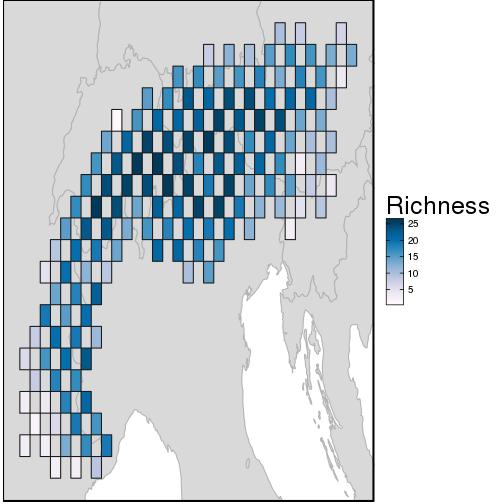
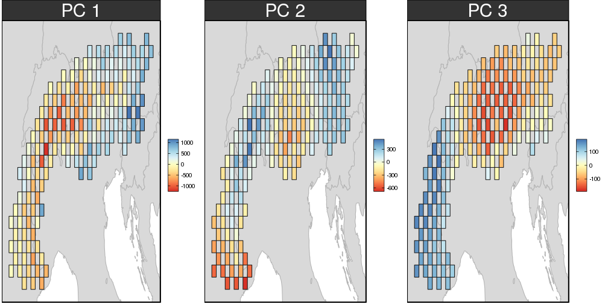
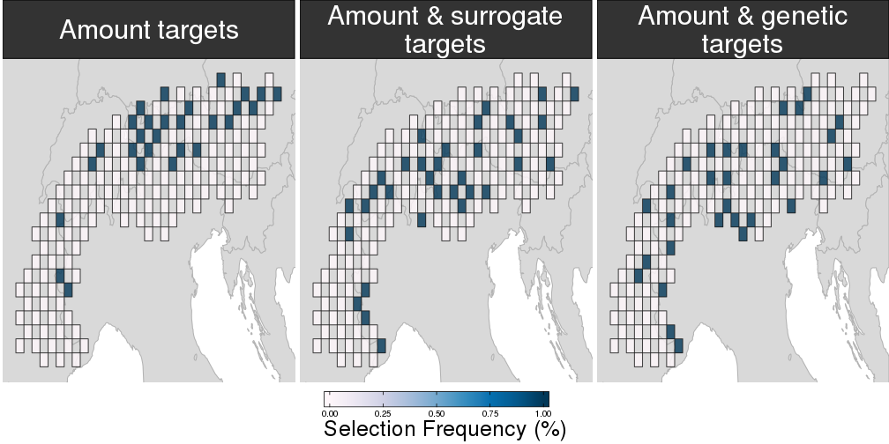
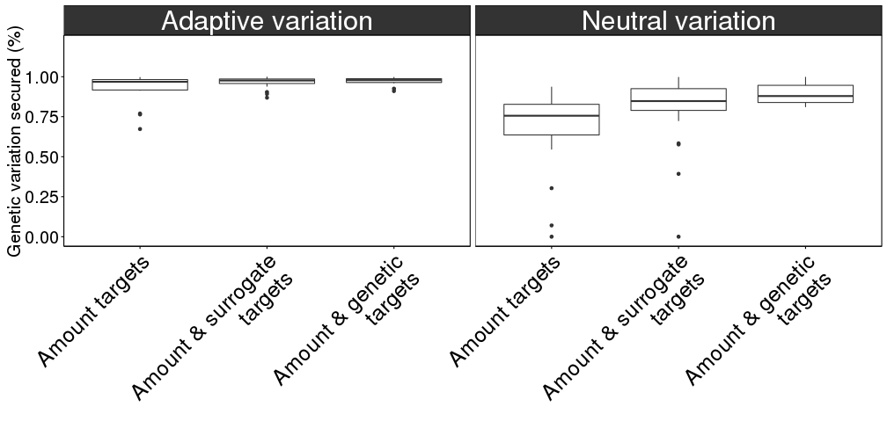

## Conserving genetic variation

### Adaptive variation
* genetic variation that affects fitness
* caused by abiotic and biotic factors
* helps foster resilience to short-term environmental change

### Neutral variation
* genetic variation that *does not* affects fitness
* arises due to break-down in gene flow
* helps avoid inbreeding depression

# Typically prioritizations assume zero genetic variation within species: *can we use cheap variables as surrogates to make better decisions*?

--- .class #slide1

## Study area

--- .class #slide2

## Climatic variation

--- .class #slide3

## Preliminary results: prioritisations

--- .class #slide4

## Preliminary results: performance

--- .class #slide5

